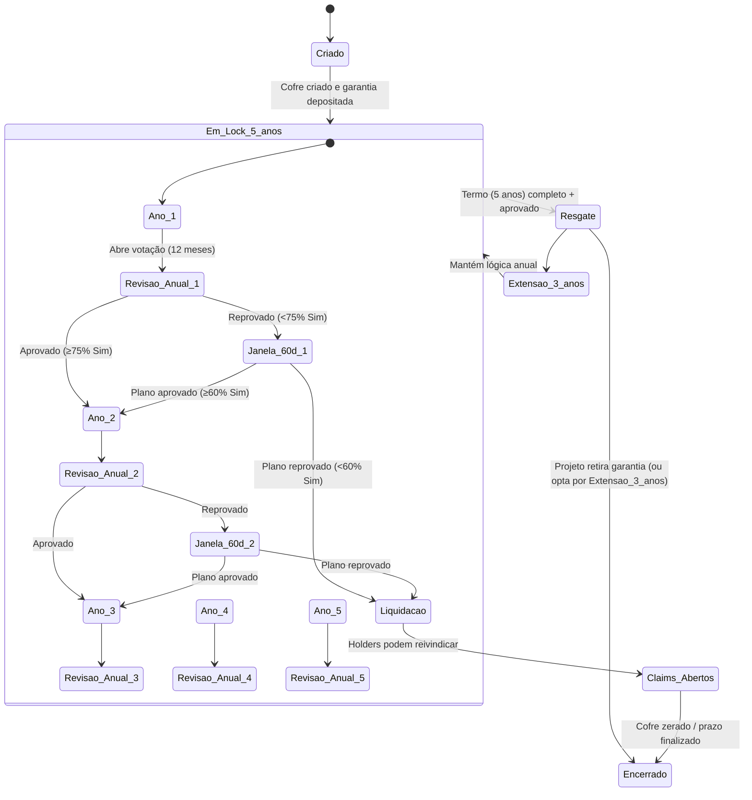
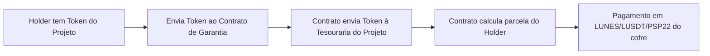

# SafeGard — Documento de Requisitos (SRS)

**Produto:** SafeGard (cofres de garantia on‑chain para projetos na rede Lunes)

**Versão:** 1.0
**Data:** 23/08/2025
**Autores:** Equipe SafeGard / Lunes Ecosystem

---

## 0. Sumário Executivo

SafeGard é uma plataforma on‑chain que **custodia garantias** de projetos Web3 (tokens **PSP22** e **NFTs**) **na rede Lunes**, impondo **LUNES como colateral obrigatório** e dominante. O sistema cria **cofres segregados por projeto**, aplica **governança anual** com janelas de correção, e **distribui o colateral** para holders do token do projeto quando critérios de reprovação são atingidos. Inclui **modelo de Score (0–100)** que prioriza Lunes (até 95 pts) e limita contribuição de outros tokens a 5 pts.

---

## 1. Objetivos & Escopo

**OBJ‑1.** Custodiar garantias on‑chain para mitigar risco de execução de projetos.
**OBJ‑2.** Garantir **segregação** de fundos por projeto (isolamento de falhas).
**OBJ‑3.** Prover **governança anual** com quóruns/limiares definidos.
**OBJ‑4.** Viabilizar **liquidação e distribuição** de garantia quando necessário.
**OBJ‑5.** Calcular **Score de Garantia (0–100)** conforme política SafeGard/Lunes.
**OBJ‑6.** Operar com **taxas** definidas em LUNES e LUSDT, e com **whitelist** de PSP22.

**Fora do escopo (v1):** KYC/AML nativo; ponte cross‑chain; UI móvel nativa.

---

## 2. Definições, Atores e Premissas

**Atores**

* **Dev Projeto (DEV):** registra projeto, deposita garantia, propõe plano de correção.
* **Holder/Comunidade (USER):** possui token do projeto; vota; reivindica garantia na liquidação.
* **Protocolo (DAO/Governança):** define parâmetros globais; whitelists; taxas; haircuts.

**Premissas**

* Rede **Lunes**; padrões **PSP22**/**NFT** compatíveis.
* **LUNES é obrigatório** como colateral (sem LUNES ⇒ score 0 e rejeição de cofre).
* **Regra de queima de taxas da Lunes**: quando supply > 50M, 12.5% da taxa vai para Tesouraria e 12.5% é queimada; ≤ 50M, 25% Tesouraria, 0% queima.

---

## 3. Visão Geral da Solução

* **Factory** cria **ProjectVault** (cofre) segregado por projeto.
* **VotingManager** agenda **votação anual** (12 meses).
* **Treasury (Protocolo)** recebe taxas (depósito e votação).
* **Score Engine** calcula score 0–100 para o projeto (on‑chain ou off‑chain autenticado).
* **Liquidação**: se votações reprovam e proposta não alcançar 60% “Sim”, abre claims para holders mediante **devolução do token do projeto** ao cofre; tokens do projeto seguem para **Tesouraria do Projeto**.

---

## 4. Requisitos Funcionais (RF)

### Registro, Cofre e Colateral

* **RF‑001**: O sistema **deve** permitir registro de projeto com: nome, descrição, endereço do contrato (PSP22/NFT) **na rede Lunes**, endereço da **Tesouraria do Projeto**.
* **RF‑002**: O **Factory** **deve** criar **um cofre (ProjectVault) exclusivo** por projeto.
* **RF‑003**: O cofre **deve** aceitar depósitos de garantia em **LUNES (obrigatório)**, **LUSDT** e **PSP22 whitelisted**.
* **RF‑004**: **LUNES obrigatório**: o cofre **não** é ativado se `C_L == 0`.
* **RF‑005**: O depósito **padrão** do DEV configura **lock de 5 anos**, com opção de **extensão por +3 anos**.
* **RF‑006**: **Qualquer carteira** (equipe ou comunidade) pode **depositar mais** a qualquer tempo, sem direito a resgate (**doação** para o cofre do projeto).
* **RF‑007**: Cada **depósito** (inclusive doações) **deve** cobrar **taxa fixa: 100 LUNES + 10 LUSDT**, enviada à **Treasury (Protocolo)**.

### Governança & Votações

* **RF‑008**: O sistema **deve** abrir automaticamente **uma votação a cada 12 meses** após a criação do cofre (ciclo de governança anual).
* **RF‑009**: Elegibilidade de voto: somente carteiras com **token do projeto** no **snapshot** da votação.
* **RF‑010**: O **limiar de continuidade** do projeto **deve** ser **≥ 75% “Sim”**.
* **RF‑011**: Se o projeto **não** alcançar 75% “Sim”, abre‑se **Janela de 60 dias** para submissão de **Proposta de Correção**.
* **RF‑012**: A **Proposta** **deve** ser considerada **aprovada** se obtiver **≥ 60% “Sim”**.
* **RF‑013**: Votações **devem** cobrar **taxas em LUNES e LUSDT** (valores parametrizáveis) creditadas à **Treasury (Protocolo)**.
* **RF‑014**: Em caso de **aprovação**, o projeto segue e a próxima votação abre **após 12 meses**.

### Liquidação & Claims

* **RF‑015**: Se a Proposta **não** atingir 60% “Sim”, o cofre entra em **liquidação** e abre‑se **período de claim** para os holders.
* **RF‑016**: Para receber a parte da garantia, o holder **deve** **devolver** o **token do projeto** ao **Contrato de Garantia**.
* **RF‑017**: Ao receber tokens do projeto, o contrato **deve** transferi‑los para a **Tesouraria do Projeto**.
* **RF‑018**: O cofre **deve** pagar ao holder a parcela de **LUNES/LUSDT/PSP22** segundo **fórmula de rateio** definida (ponderação LUNES +95%).
* **RF‑019**: O contrato **deve** emitir **eventos** on‑chain para registro de estado (claims, pagamentos, encerramento).

### Score de Garantia (0–100)

* **RF‑020**: Implementar **Score v1.1** com **LUNES dominante (até 95 pts)** e **outros tokens até 5 pts**.
* **RF‑021**: **Sem LUNES** (`C_L = 0`) ⇒ **Score = 0**.
* **RF‑022**: **Uplift temporal** por **queima lenta** (200M → 50M) aplicado ao **alvo de LUNES** para 95 pts, **sem usar preços/oráculos** no componente LUNES.
* **RF‑023**: Outros tokens **devem** ser convertidos em **LUNES‑equivalentes** via **haircuts** e **TWAP** (apenas para extras) e então limitados a **5 pts**.
* **RF‑024**: Parâmetros de governança do score (α, γ, δ, T\_min, θ, S\_ref, haircuts) **devem** ser publicáveis e auditáveis.

### Whitelists, Parâmetros e Taxas

* **RF‑025**: **Whitelist** de PSP22 elegíveis e **haircuts** por token **devem** ser geridos por governança.
* **RF‑026**: **Taxas** (depósito e votação) **devem** ser ajustáveis por governança.
* **RF‑027**: O **piso de supply (F)** para a Lunes (50M fee‑only; mistura com 30M via κ se plano extra de queima) **deve** ser configurável por governança.

---

## 5. Requisitos Não Funcionais (RNF)

* **RNF‑001 Segurança:** Invariantes de cofres segregados; transferências apenas via regras do contrato; nenhuma chave de operador com acesso aos fundos.
* **RNF‑002 Confiabilidade:** Snapshots para votações/claims; reentrância bloqueada; checagens de underflow/overflow; pausas de emergência (circuit breaker).
* **RNF‑003 Observabilidade:** Emissão de eventos: `ProjectRegistered`, `Deposit`, `VoteOpened`, `VoteClosed`, `PlanProposed`, `PlanApproved/Rejected`, `ClaimsOpened`, `ClaimPaid`, `VaultClosed`.
* **RNF‑004 Desempenho/Taxas:** Otimizar loops (pagamentos por claim individual); limites de gas por operação; particionar claims em múltiplas txs.
* **RNF‑005 Governança:** Todos os parâmetros sensíveis publicáveis; mudanças registradas via eventos.
* **RNF‑006 Compatibilidade:** Conformidade com **PSP22**/**NFT** da Lunes; integração com oráculos/TWAP para extras.
* **RNF‑007 Auditabilidade:** Código comentado; especificações formais de invariantes e máquina de estados; testes abrangentes; auditoria externa recomendada antes do deploy final.

---

## 6. Dados & Modelo de Estados

**Entidades‑chave**

* **Projeto**: {id, nome, descrição, addr\_token, tipo (PSP22/NFT), addr\_tesouraria\_projeto, data\_criação}.
* **Cofre**: {id\_projeto, saldos\_por\_token, locked\_until, extended\_flag}.
* **Depósito**: {addr, token, amount, data, taxa\_cobrada}.
* **Votação**: {id, id\_projeto, snapshot\_block, start\_ts, end\_ts, quorum, yes\_pct, taxas\_cobradas}.
* **Proposta**: {id\_votação, url/descrição, start\_ts, end\_ts, resultado}.
* **Claim**: {addr\_holder, amount\_por\_ativo, status, tx\_hash}.
* **Score**: {id\_projeto, inputs, params, resultado, timestamp}.

**Máquina de Estados (simplificada)**
`Criado` → `Em_Lock_5_anos` → {`Revisão Anual` (aprovado) → próximo ano | `Janela 60d` (reprovado) → {`Plano aprovado`|`Liquidação`}} → {`Resgate` (após 5 anos) | `Extensão +3y`} → `Encerrado`.

---

## 7. Fórmulas & Score (v1.1)

### 7.1 Uplift temporal pela queima lenta (componente LUNES)

* Progresso de queima: `π = clamp((200M − S_L_atual)/(200M − F), 0, 1)`
* Alvo base (95 pts) por tamanho do projeto: `r_proj = S_p/S_ref;  T_base = max(T_min, α·r_proj^γ)`
* Uplift: `T' = T_base / (1 + θ·π)`
* **LUNES (até 95 pts)**: `S_Lunes = 95·min(1, C_L/T')` (se `C_L > 0`; senão 0)

### 7.2 Extras (até 5 pts)

* LUNES‑equivalentes: `E_other = Σ h_j·(p_j·C_j)/p_L`
* Escassez/tamanho: `S_L_eff = (1 − π)·S_L_atual + π·F;  r_extra = S_p/S_L_eff;  g = 1/(1 + r_extra^δ)`
* Proporção vs LUNES: `q = E_other/max(C_L, ε)`
* **Score extras**: `S_other = 5·min(1, q·g)`
* **Score final**: `Score = min(100, S_Lunes + S_other)`

Parâmetros publicáveis: `α, γ, δ, T_min, θ, S_ref, haircuts {h_j}, F, κ, ε`.

---

## 8. Interfaces de Contratos (esqueleto)

> Sintaxe indicativa (ink!/PSP22). Ajustar conforme SDK da rede Lunes.

**Factory**

* `register_project(name, desc, addr_token, type, addr_treasury) → project_id`
* `create_vault(project_id) → addr_vault`

**ProjectVault**

* `deposit(token_addr, amount) payable`
* `donate(token_addr, amount) payable` (sem resgate)
* `open_claims()` (chamado pelo VotingManager após lógica de reprovação)
* `claim(project_token_amount)` (holder envia token do projeto; contrato paga proporcional)
* `extend_lock(+3y)` (opcional pelo DEV quando elegível)
* `get_balances()`

**VotingManager**

* `schedule_annual(project_id)`
* `open_vote(project_id)` / `close_vote(project_id)`
* `open_correction_window(project_id, 60d)`
* `submit_plan(project_id, uri)`
* `vote(project_id, yes/no) payable`
* `finalize(project_id)` → {continua | liquidação}

**Treasury (Protocolo)**

* `collect_fee_deposit(100 LUNES + 10 LUSDT)`
* `collect_fee_vote(LUNES + LUSDT, valores via governança)`
* `report()`

**Eventos**

* Vide RNF‑003.

---

## 9. Taxas & Tesourarias

* **Taxa por depósito/doação**: **100 LUNES + 10 LUSDT** (fixo; governança pode alterar).
* **Taxa por votação**: valores em LUNES e LUSDT **definidos por governança**.
* **Destino**: **Treasury (Protocolo)**, com relatórios on‑chain.

---

## 10. Critérios de Aceite (amostras)

**CA‑001 — Criação de Cofre**
*Dado* um projeto válido com addr do token Lunes‑chain
*Quando* o DEV registra e cria cofre
*Então* deve existir `ProjectVault` exclusivo e eventos `ProjectRegistered`/`VaultCreated` emitidos.

**CA‑002 — Depósito e Taxas**
*Dado* um cofre ativo
*Quando* qualquer carteira deposita LUNES/PSP22/LUSDT
*Então* a taxa fixa é cobrada e enviada à Treasury, e o saldo do cofre é atualizado.

**CA‑003 — Votação Anual**
*Dado* um cofre com 12 meses desde a criação
*Quando* `open_vote` é chamado
*Então* apenas carteiras com token do projeto no snapshot podem votar; taxas são cobradas; `VoteOpened` é emitido.

**CA‑004 — Liquidação**
*Dado* reprovação + proposta < 60%
*Quando* `open_claims` é chamado
*Então* holders que devolverem tokens do projeto recebem pagamentos proporcionais; tokens vão à Tesouraria do Projeto; `ClaimPaid` é emitido por pagamento.

**CA‑005 — Score**
*Dado* entradas válidas
*Quando* o Score Engine calcula
*Então* **LUNES** contribui até **95** e extras até **5**; `C_L=0` ⇒ **Score=0**; parâmetros refletem governança.

---

## 11. Segurança & Invariantes

* **INV‑001:** Fundos de um cofre **não** podem ser movidos para outro cofre.
* **INV‑002:** **Nenhum resgate** para depósitos de terceiros (doações).
* **INV‑003:** **Claims** apenas mediante **devolução** do token do projeto.
* **INV‑004:** Sem chaves privilegiadas para movimentar colateral fora das regras.
* **INV‑005:** Proteção anti‑reentrância; validações de entrada; limites por transação.

Ameaças consideradas: manipulação de oráculo (para extras), spam de votação (mitigado por taxas), sybil (snapshot + posse do token do projeto), draining via reentrância (guardas), griefing em claims (janelas e limites).

---

## 12. Testes & Qualidade

* **Unitários:** depósitos, taxas, votações, claims, score.
* **Property‑based:** conservação de saldos; distribuição proporcional; invariantes.
* **Fuzzing:** inputs extremos; concorrência de eventos.
* **Integração:** PSP22/NFT; oráculos/TWAP; governança.
* **Testnet:** cenários fim‑a‑fim (5y simulados; liquidação; extensão +3y).
* **Auditoria:** revisão externa antes do mainnet.

---

## 13. Observabilidade & Métricas

* **KPIs:** nº de projetos, TVL por cofre, taxas coletadas, taxa de aprovação anual, percentil de claims, tempo médio de liquidação.
* **Alertas:** falhas de apuração, divergência de oráculos, anomalias de eventos, saldos residuais acima do limiar.

---

## 14. Lançamento & Roadmap

* **Fase A (MVP):** Factory, Vault, VotingManager (governança anual), Treasury, Score Engine off‑chain assinado.
* **Fase B:** Score on‑chain opcional; UI web; painéis de monitoramento; parâmetros dinâmicos.
* **Fase C:** Mecanismos avançados (anti‑sybil, delegação de voto, batch‑claims), integrações externas.

---

## 15. Parâmetros Iniciais (sugestão)

* **Taxa Depósito:** 100 LUNES + 10 LUSDT
* **Taxa Votação:** (definir via governança)
* **Score:** `α=500k`, `γ=1.2`, `δ=1`, `T_min=100k`, `θ=0.20`, `S_ref=1 bi`, `ε=1e−9`
* **Haircuts:** LUSDT=0.9; PSP22 blue‑chip=0.6–0.8; PSP22 genérico=0.3–0.5
* **Piso supply (F):** 50M (fee‑only) ou mistura com 30M via κ quando plano extra de queima for aprovado.

---

## 16. Anexos

* **A. Diagrama de arquitetura e estados** (ver canvas do projeto)
* **B. Pseudocódigo do Score v1.1** (incluído no documento de score)
* **C. Planilha de cálculo** (versão v1.1)

> Este SRS consolida as regras de negócio já definidas (cofres segregados, governança anual, janelas de 60 dias, liquidação com devolução de token do projeto, taxas fixas e score com LUNES dominante). Ajustes finos (parâmetros, haircuts, valores de taxa) serão geridos por governança.


# SafeGard — Diagrama de Regras de Negócio (Ecossistema Lunes)

> **Objetivo**: plataforma on‑chain que **custodia garantias** de projetos (PSP22/NFT) na rede **Lunes**, com **cofres segregados por projeto**, governança anual e **distribuição de colateral** em cenários de reprovação.

---

## 1) Parâmetros & Regras-Chave

* **Tokens aceitos como garantia**: **LUNES (obrigatório)**, **LUSDT** e outros **PSP22** da rede Lunes.
* **Peso de garantia**: depósitos em **LUNES têm peso +95%** em relação a outros tokens (\*uso na distribuição, ver Fórmula de Rateio).
* **Bloqueio (lock)**: **5 anos** por padrão, com opção de **extensão por +3 anos**.
* **Ciclo de governança**: **a cada 12 meses** abre votação automática para avaliar o **avanço do projeto**.

  * **Aprovação**: **≥ 75% “Sim”** ⇒ projeto segue normalmente e a próxima votação ocorre **12 meses** depois.
  * **Reprovação** (< 75% “Sim”): abre‑se uma **janela de 60 dias** para o projeto **propor um plano** e submetê‑lo à aprovação.

    * **Reapreciação**: se a proposta **não** for aprovada com **≥ 60% “Sim”**, inicia‑se **distribuição de garantia aos holders** do token do projeto.
* **Elegibilidade de voto**: o usuário precisa **ter tokens do projeto** na carteira (snapshot no início de cada votação).
* **Taxas**:

  * **Depósito (por qualquer parte, dev ou comunidade)**: **100 LUNES + 10 LUSDT** (fixo).
  * **Votações**: cobram **taxas em LUNES e LUSDT** (valores a definir pelo protocolo/DAO).
* **Depósitos adicionais**: a equipe do projeto **ou qualquer membro da comunidade pode depositar** para **aumentar a garantia** **a qualquer momento**. **Não há resgate** desses acréscimos (natureza de **doação ao cofre do projeto**).
* **Cofres segregados**: cada projeto possui **um cofre (vault) próprio** gerido **somente por contratos** SafeGard (mitigação de risco sistêmico).
* **Resgate ao final**: após **5 anos**, se o projeto foi aprovado nos ciclos, **recebe de volta a garantia** (ou opta por **manter por +3 anos**).
* **Distribuição em caso de reprovação**:

  * O **investidor** recebe sua parcela **em LUNES/LUSDT/PSP22** do cofre **proporcionalmente** (ver fórmulas), **desde que devolva o token do projeto** ao **Contrato de Garantia**.
  * O contrato **redireciona** os tokens do projeto **à Tesouraria do Projeto** automaticamente.

> **Observação de projeto**: O **peso +95%** de LUNES aplica‑se **na composição do cofre** para fins de **rateio de valor** em uma liquidação. A **ponderação de voto** segue a **quantidade de tokens do projeto** por carteira (modelo 1‑token‑1‑voto por padrão; pode ser atualizado por governança).

---

## 2) Arquitetura Lógica (Contratos)

```mermaid
flowchart LR
  %% Atores
  Dev[Desenvolvedor do Projeto]
  User[Holder / Comunidade]

  %% Módulos SafeGard
  subgraph SafeGard Core
    Factory[SafeGardFactory]
    VM[VotingManager]
    TR[Treasury (Protocol Fees)]
  end

  %% Cofre por Projeto
  subgraph Projeto X
    PV[ProjectVault (Cofre do Projeto)]
    PT[Tesouraria do Projeto]
  end

  %% Tokens
  LUNES[LUNES (obrigatório)]
  LUSDT[LUSDT]
  PSP22[Outros PSP22]
  PToken[Token do Projeto (PSP22 ou NFT)]

  Dev -- registra projeto / metadata --> Factory
  Factory -- cria --> PV

  Dev -- deposita garantia --> PV
  User -- depósito-doação (sem resgate) --> PV

  LUNES -- entra --> PV
  LUSDT -- entra --> PV
  PSP22 -- entra --> PV

  VM -- inicia votação anual --> User
  User -- votos (taxas LUNES+LUSDT) --> VM
  VM -- encaminha taxas --> TR

  VM -- decisão --> PV
  PV -- se reprovado e sem plano aprovado --> User
  User -- devolve PToken para claim --> PV
  PV -- envia PToken --> PT
  PV -- paga claim (LUNES/LUSDT/PSP22) --> User

  PV -. após 5 anos e aprovado .-> Dev
  Dev -. opção de extensão +3 anos .-> PV
```

---

## 3) Ciclo de Vida do Projeto (Máquina de Estados)



---

## 4) Votação Anual — Fluxo Operacional

```mermaid
flowchart TD
  A[Início do Ciclo (12 meses)] --> B[Criar Votação]
  B --> C[Snapshot de elegibilidade (token do projeto)]
  C --> D[Usuários votam (pagam taxas em LUNES/LUSDT)]
  D --> E[Apuração]
  E --> |≥ 75% Sim| F[Continua normalmente]
  F --> G[Próxima votação em 12 meses]
  E --> |< 75% Sim| H[Janela de 60 dias para Proposta]
  H --> I[Comunidade vota proposta]
  I --> |≥ 60% Sim| F
  I --> |< 60% Sim| J[Liquidação: abrir período de claims]
```

---

## 5) Liquidação — Devolução do Token & Claim



**Fórmula de Rateio (visão de alto nível)**

* **Snapshot**: `supply_snapshot = total de tokens do projeto em circulação elegíveis`.
* **Quota por holder**: `q_i = balance_i_snapshot / supply_snapshot`.
* **Peso por ativo no cofre**: `w(LUNES) = 1.95`, `w(outros) = 1.00`.
* **Pool ponderado por ativo**: `pool*_a = w(a) × saldo_a` para cada ativo `a ∈ {LUNES, LUSDT, PSP22_k}`.
* **Parcela por ativo**: `claim_i(a) = q_i × pool*_a` (limitado ao saldo disponível; arredondamento conservador pro protocolo).

> Observação: a política de **arredondamento** e **ordem de pagamento** (ex.: prioridade LUNES → LUSDT → demais PSP22) pode ser definida via governança para reduzir resíduos de poeira.

---

## 6) Depósitos Adicionais (Doação para o Cofre)

```mermaid
flowchart TD
  U[Dev/Comunidade] --> V[Depositar no Cofre do Projeto]
  V --> W[Cobrança de taxa fixa: 100 LUNES + 10 LUSDT]
  W --> X[Incrementa saldo do cofre (sem direito a resgate)]
```

---

## 7) Segurança & Governança

* **Segregação**: cada **ProjectVault** é isolado (sem shared balance entre projetos).
* **Somente‑contrato**: transferências/resgates são **exclusivamente** via regras do contrato (sem chaves de operador).
* **Snapshots**: congelam elegibilidade e pesos para cada votação/claim.
* **Eventos on‑chain**: `ProjectRegistered`, `Deposit`, `VoteOpened`, `VoteClosed`, `PlanProposed`, `PlanApproved/Rejected`, `ClaimsOpened`, `ClaimPaid`, `VaultClosed`.
* **Atualização de parâmetros**: via governança (ex.: valores de taxa de votação, janela de claim, prioridades de pagamento, política anti‑sybil, etc.).

---

## 8) Checklist para Implementação (ink! / PSP22)

* [ ] **SafeGardFactory**: registro de metadados (nome, descrição, endereço do contrato do **token do projeto**/**web3**/**NFT** em Lunes), criação do **ProjectVault**.
* [ ] **ProjectVault**:

  * depósitos aceitos (**LUNES obrigatório** + LUSDT + PSP22);
  * pesos por ativo;
  * bloqueio temporal (5y + extensão 3y);
  * **claims** com **devolução de token** do projeto → envio automático à **Tesouraria do Projeto**;
  * contabilidade de taxas fixas (100 LUNES + 10 LUSDT) → **Treasury**.
* [ ] **VotingManager**: agendador anual, snapshots, quóruns/limiares (75% / 60%), janela de 60 dias, roteamento de taxas de votação para **Treasury**.
* [ ] **Treasury (Protocolo)**: recebimento de taxas (depósito & votação), relatório on‑chain.
* [ ] **Interfaces PSP22/NFT**: checagem de saldo para elegibilidade de voto; coleta/queima/transferência do **token do projeto** no claim.

---

> **Próximos passos sugeridos**: se quiser, posso transformar este documento em **SVGs** separados (arquitetura, estados, fluxos) e/ou em **PDF** pronto para apresentação, além de gerar um **esqueleto de contratos ink!** com estes módulos.

---

# Score de Garantia — v1.1 (Resumo Operacional + Diagrama)

> Modelo 0–100 para avaliar garantias por projeto na rede **Lunes**: **LUNES = até 95 pts** (obrigatório), **outros tokens (LUSDT/PSP22) = até 5 pts**. Inclui uplift temporal suave ligado à **queima lenta** (200M → 50M) sem depender de oráculos de preço para o componente LUNES.

## Entradas (alto nível)

* S\_p: supply do token do projeto (ou tamanho da coleção NFT)
* C\_L: LUNES depositado (colateral obrigatório)
* Outros tokens aceitos j: C\_j, preço p\_j, haircut h\_j (ex.: LUSDT 0.9; PSP22 0.3–0.8)
* p\_L: preço do LUNES (apenas para converter extras em LUNES‑equivalentes)
* S\_L\_atual: supply atual de LUNES
* Flags: plano de queima extra? (define piso F = 50M padrão ou mistura com 30M via kappa)
* Parâmetros: alpha, gamma, delta, T\_min, theta (0–0.30), S\_ref (ex.: 1 bi), epsilon

## Passos do cálculo

1. Progresso da queima: pi = clamp((200M − S\_L\_atual)/(200M − F), 0, 1)
2. Supply efetivo para extras: S\_L\_eff = (1 − pi)*S\_L\_atual + pi*F (F=50M padrão)
3. Alvo base p/ 95 pts (somente tamanho do projeto): r\_proj = S\_p/S\_ref; T\_base = max(T\_min, alpha\*r\_proj^gamma)
4. Uplift temporal pela queima: T' = T\_base / (1 + theta\*pi)
5. Componente LUNES (até 95): S\_Lunes = 95\*min(1, C\_L/T') se C\_L>0; senão 0
6. Extras (até 5):

   * LUNES‑equivalentes: E\_other = sum\_j h\_j\*(p\_j\*C\_j)/p\_L
   * Penalização por escassez/tamanho: r\_extra = S\_p/S\_L\_eff; g = 1/(1 + r\_extra^delta)
   * Proporção frente ao LUNES: q = E\_other/max(C\_L, epsilon)
   * Score extras: S\_other = 5*min(1, q*g)
7. Score final: Score = min(100, S\_Lunes + S\_other)

## Diagrama do fluxo (alto nível)

```mermaid
flowchart TD
  A[Entradas: S_p, C_L, {C_j,p_j,h_j}, p_L, S_L_atual, params] --> B[Queima: pi]
  B --> C[S_L_eff]
  C --> D[r_proj, T_base]
  D --> E[T' = T_base/(1 + theta*pi)]
  E --> F[S_Lunes = 95 * min(1, C_L/T')]
  B --> G[r_extra = S_p/S_L_eff]
  G --> H[g = 1/(1 + r_extra^delta)]
  A --> I[E_other = sum h_j*(p_j*C_j)/p_L]
  I --> J[q = E_other/max(C_L, epsilon)]
  H --> K[S_other = 5*min(1, q*g)]
  F --> L[Score = min(100, S_Lunes + S_other)]
  K --> L
```

## Pseudocódigo compacto

```
inputs: S_p, C_L, {C_j,p_j,h_j}, p_L, S_L_atual, has_extra_burn, kappa
params: alpha, gamma, delta, T_min, theta, S_ref, epsilon
const: S_L_inicial=200e6; F_fee=50e6; F_gov=30e6
F = has_extra_burn ? (kappa*F_gov + (1-kappa)*F_fee) : F_fee
pi = clamp((S_L_inicial - S_L_atual) / (S_L_inicial - F), 0, 1)
S_L_eff = (1 - pi)*S_L_atual + pi*F
r_proj = S_p / S_ref
T_base = max(T_min, alpha * r_proj**gamma)
Tprime = T_base / (1 + theta*pi)
if C_L <= 0: return 0
S_Lunes = 95 * min(1, C_L / Tprime)
E_other = sum(h_j * (p_j*C_j) / max(p_L, 1e-9) for each j)
q = E_other / max(C_L, epsilon)
r_extra = S_p / max(S_L_eff, 1e-9)
g = 1 / (1 + r_extra**delta)
S_other = 5 * min(1, q*g)
Score = min(100, S_Lunes + S_other)
```

> Observação: a seção completa com fórmulas matemáticas e exemplos detalhados está acima; esta é a versão operacional resumida com diagrama e pseudocódigo.

# Create a small calculator for the SafeGard Score v1.1
# - Implements the user's formula (v1.1 uplift by burn)
# - Generates an example table matching the user's illustrative case
# - Exports an Excel workbook with parameters and an example sheet

import math
import pandas as pd
from typing import List, Dict, Any, Tuple

# Core function for score calculation (v1.1)
def safegard_score_v11(
    S_p: float,                   # project supply
    C_L: float,                   # LUNES collateral
    other_tokens: List[Dict[str, Any]],  # list of dicts: {'symbol': str, 'amount': float, 'price': float, 'haircut': float}
    p_L: float,                   # LUNES price (for extras conversion only)
    S_L_atual: float,            # current LUNES supply
    has_extra_burn_schedule: bool = False,
    kappa: float = 0.0,          # [0..1] weight towards 30M floor if extra burn schedule exists
    # parameters
    alpha: float = 5_000_000.0,
    gamma: float = 1.2,
    delta: float = 1.0,
    T_min: float = 100_000.0,
    theta: float = 0.20,
    S_ref: float = 1_000_000_000.0,
    epsilon: float = 1e-9,
) -> Dict[str, float]:
    S_L_inicial = 200_000_000.0
    F_fee = 50_000_000.0
    F_gov = 30_000_000.0
    F = F_fee
    if has_extra_burn_schedule:
        F = kappa * F_gov + (1 - kappa) * F_fee

    # progress of burn
    denom = max(S_L_inicial - F, epsilon)
    pi = (S_L_inicial - S_L_atual) / denom
    pi = max(0.0, min(1.0, pi))

    # effective supply for extras
    S_L_eff = (1 - pi) * S_L_atual + pi * F

    # base target solely from project size
    r_proj = S_p / max(S_ref, epsilon)
    T_base = max(T_min, alpha * (r_proj ** gamma))
    T_prime = T_base / (1 + theta * pi)

    # LUNES component
    if C_L <= 0:
        S_Lunes = 0.0
        S_other = 0.0
        return {
            "pi": pi, "S_L_eff": S_L_eff, "r_proj": r_proj, "T_base": T_base, "T_prime": T_prime,
            "S_Lunes": S_Lunes, "S_other": S_other, "Score": 0.0
        }

    S_Lunes = 95.0 * min(1.0, C_L / max(T_prime, epsilon))

    # extras conversion to LUNES-equivalents
    E_other = 0.0
    for tok in other_tokens:
        amount = float(tok.get("amount", 0.0))
        price = float(tok.get("price", 0.0))
        haircut = float(tok.get("haircut", 0.0))
        E_other += haircut * (price * amount) / max(p_L, epsilon)

    q = E_other / max(C_L, epsilon)

    # penalty based on scarcity/size
    r_extra = S_p / max(S_L_eff, epsilon)
    g = 1.0 / (1.0 + (r_extra ** delta))

    S_other = 5.0 * min(1.0, q * g)

    Score = min(100.0, S_Lunes + S_other)

    return {
        "pi": pi, "S_L_eff": S_L_eff, "r_proj": r_proj, "T_base": T_base, "T_prime": T_prime,
        "r_extra": r_extra, "g": g, "E_other": E_other, "q": q,
        "S_Lunes": S_Lunes, "S_other": S_other, "Score": Score
    }

# Build illustrative table as in section 20.2 (no extras)
def build_example_table():
    alpha = 500_000.0
    gamma = 1.2
    delta = 1.0
    T_min = 100_000.0
    theta = 0.20
    S_ref = 1_000_000_000.0

    S_p = 300_000_000.0
    C_L = 10_000.0
    p_L = 0.10
    other_tokens = []  # none

    supplies = [200_000_000, 150_000_000, 120_000_000, 100_000_000, 80_000_000, 60_000_000, 50_000_000]
    rows = []
    for S_L_atual in supplies:
        res = safegard_score_v11(
            S_p=S_p, C_L=C_L, other_tokens=other_tokens, p_L=p_L, S_L_atual=S_L_atual,
            has_extra_burn_schedule=False, kappa=0.0,
            alpha=alpha, gamma=gamma, delta=delta, T_min=T_min, theta=theta, S_ref=S_ref
        )
        rows.append({
            "Supply Lunes atual (M)": round(S_L_atual/1e6, 3),
            "pi": round(res["pi"], 3),
            "S_L_eff (M)": round(res["S_L_eff"]/1e6, 3),
            "r_extra": round(res.get("r_extra", float('nan')), 3),
            "T_base": round(res["T_base"], 3),
            "u(pi)": round(1 + theta*res["pi"], 3),
            "T'": round(res["T_prime"], 3),
            "S_Lunes": round(res["S_Lunes"], 3),
            "Score": round(res["Score"], 3),
        })
    return pd.DataFrame(rows)

# Also create a template sheet for users to plug their own values (up to 5 extra tokens)
def build_template_sheet():
    columns = [
        "S_p (project supply)",
        "C_L (LUNES collateral)",
        "S_L_atual (current LUNES supply)",
        "p_L (LUNES price)",
        "alpha","gamma","delta","T_min","theta","S_ref","epsilon",
        "has_extra_burn_schedule","kappa",
        # up to 5 tokens: symbol, amount, price, haircut
    ]
    for i in range(1, 6):
        columns += [f"tok{i}_symbol", f"tok{i}_amount", f"tok{i}_price", f"tok{i}_haircut"]
    # One sample row
    data = [[
        300_000_000, 10_000, 150_000_000, 0.10,
        500_000, 1.2, 1.0, 100_000, 0.20, 1_000_000_000, 1e-9,
        False, 0.0,
        "LUSDT", 0, 1.0, 0.9,
        "PSP22A", 0, 0.5, 0.5,
        "PSP22B", 0, 0.0, 0.4,
        "", 0, 0.0, 0.0,
        "", 0, 0.0, 0.0,
    ]]
    return pd.DataFrame(data, columns=columns)

# Write Excel with two sheets
example_df = build_example_table()
template_df = build_template_sheet()

excel_path = "/mnt/data/safegard_score_calculator_v1_1.xlsx"
with pd.ExcelWriter(excel_path, engine="xlsxwriter") as writer:
    example_df.to_excel(writer, sheet_name="Exemplo_20_2", index=False)
    template_df.to_excel(writer, sheet_name="Template_inputs", index=False)

# Show the example as an interactive table to the user
from caas_jupyter_tools import display_dataframe_to_user
display_dataframe_to_user("Exemplo SafeGard Score v1.1 (sem extras)", example_df)

